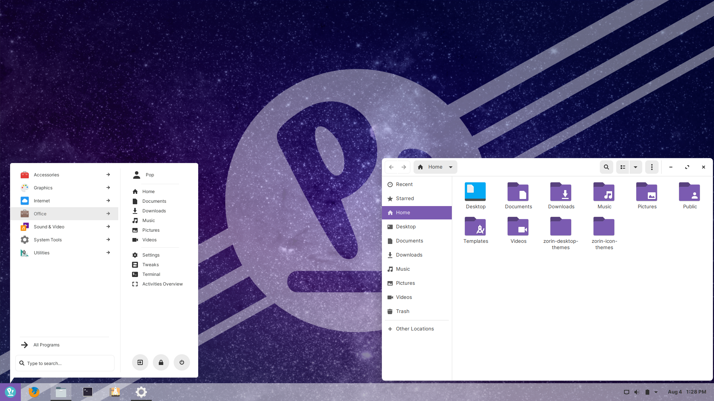
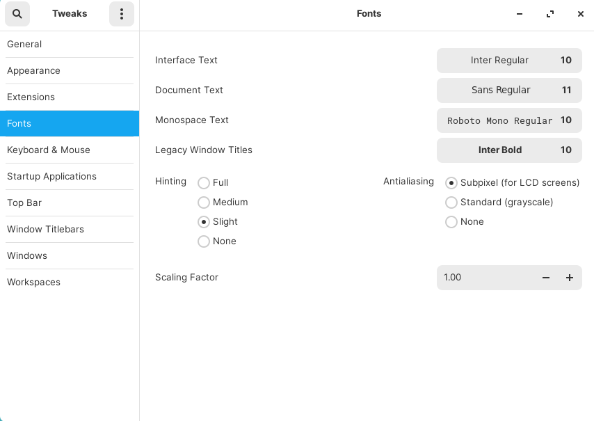

# ZorinOS theme



([source](https://bigdaddylinux.com/zorin-os-theme-on-any-distribution/))

## Install Prerequisites

```sh
sudo apt install gettext libgettextpo-dev gnome-shell-extensions gnome-tweak-tool gnome-menus gir1.2-gmenu-3.0
```

## Install GNOME Extensions

Go to https://extensions.gnome.org/ and start by installing the browser extension.

- [User Themes](https://extensions.gnome.org/extension/19/user-themes/)
- [Tray Icons](https://extensions.gnome.org/extension/1503/tray-icons/)
- [Dash to Panel](https://extensions.gnome.org/extension/1160/dash-to-panel/)
- [Arc Menu](https://extensions.gnome.org/extension/1228/arc-menu/)

## Install Zorin OS Themes and Icons

```shell
git clone https://github.com/ZorinOS/zorin-desktop-themes.git

git clone https://github.com/ZorinOS/zorin-icon-themes.git

sudo cp -r zorin-desktop-themes/Z* /usr/share/themes

sudo cp -r zorin-icon-themes/Z* /usr/share/icons
```

## GNOME Tweaks

Open Tweaks and click the Appearance tab. Choose the Zorin theme you would like to use and then the corresponding Icons and Shell themes (i..e. ZorinBlue-Light).

Let’s enable the window buttons. Go to the Windows Titlebars section and under Titlebar Buttons enable Maximize and Minimize. You can also set the button placement to left if you prefer.

Now switch to the Extensions tab.

### Dash to Panel

There are a lot of options that you can set here but the two main ones are:

#### Position Tab

Set the Clock location to ‘Right of system indicators’. I’ve noticed it doesn’t seem to take effect right away so you may have to switch to a different option and then back again.

#### Behavior Tab

Disable Show Applications icon

### Arc Menu

Same as with Dash to Panel, there are quite a few options. The main ones are:

#### General Tab

‘Choose Arc Menus Default View’ set to ‘Categories List’
Set the menu hotkey or choose a custom one.

#### Appearance Tab

Customize Menu Button Appearance (optional)

- Click the Customize Menu Button Appearance gear icon
- Select the icon you’d like to use from the drop down. If you want the Pop icon browse to `/usr/share/icons/Pop/64x64/places/` and choose `distributor-logo-pop-os.png`.
- Use the slider to set the size to 32px

## Arc Menu and Zorin OS Themes

While Arc Menu does recognize the shell theme that you set in Tweaks there are a few things that it doesn’t get right. For instance, it does not position the menu properly. It is a little too far to the right and there is extra space that obscures the small arrow shape.

Also, each Zorin OS theme has a light and dark variant. The light variants use the same separator, border and highlight colors however the dark ones use distinct colors. Arc Menu doesn’t get the coloration exactly right so in either case so it can be a little odd looking. I am including a table below with the colors for each theme but just be aware that it can take some tweaking to get things just right, particularly if you want things to match to Zorin. There is plenty of room for tweaking to get it to look the way you’d like in either case. I will explain how to change the colors for one light and one dark theme so you understand how to do it.

### Light Theme (any)

Customize Arc Menu Appearance

- Toggle Enable Vertical Separator
- Click the color block
- Click the plus icon under Custom at the bottom and enter #EBEBEB in the field.
- Press enter to set the color and then click the Select button.

Override Arch Menu Theme

- Toggle the Override Arc Menu Theme slider and click the gear icon
- Set the Menu Background Color to white. You need to do this as a custom color.
  - Click the plus icon under Custom at the bottom and enter #FFFFFF in the field.
  - Press enter to set the color and then click the Select button.
- Set the Menu Foreground Color to #333333.
- Set the Border Color to #EBEBEB. It may already be in your custom colors if you used it as the separator color above. If you want to know what color a custom color is just right click it and choose customize.
- Set the Border Size to 1px.
- Highlighted Item Color is also #EBEBEB
- Corner Radius is 5px
- Menu Arrow Size is 20px
- Menu Displacement is 15px
- Click Apply and the X to close the window.

### Dark Blue Theme

Customize Arc Menu Appearance

- Toggle Enable Vertical Separator
- Click the color block
- Click the plus icon under Custom at the bottom and enter #293237 in the field.
- Press enter to set the color and then click the Select button.

Override Arch Menu Theme

- Toggle the Override Arc Menu Theme slider and click the gear icon
- Set the Menu Background Color to #191F22
- Set the Menu Foreground Color to #BDE6FB
- Set the Border Color to #293237
- Set the Border Size to 1px
- Highlighted Item Color is also #293237
- Corner Radius is 5px
- Menu Arrow Size is 20px
- Menu Displacement is 15px
- Click Apply and the X to close the window.

#### Dark Theme Color Codes

| Theme  | Background Color | Foreground Color | Border and Highlighted Item Colors |
| ------ | :--------------: | :--------------: | ---------------------------------: |
| Blue   |     #191F22      |     #BDE6FB      |                            #293237 |
| Green  |     #141A19      |     #B0F0DF      |                            #23302C |
| Grey   |     #1B1B1B      |     #FFFFFF      |                            #323232 |
| Orange |     #221913      |     #FEBC8D      |                            #38291F |
| Purple |     #161218      |     #D6AEED      |                            #29212E |
| Red    |     #1A0B0A      |     #E35D5D      |                            #2E1313 |

## Fonts

Zorin uses a few fonts that aren’t installed by default. One is named Inter which is available from GitHub and the other is Roboto Mono which is a Google font. For Inter, go to the releases page and download the zip of the current release. Browse the directory where you downloaded it and extract the file. Enter that directory and finally the Inter (OTF) directory. Right click and choose Open in Terminal. Enter the following commands:

```shell
mkdir ~/.fonts
cp * ~/.fonts
```

For Roboto Mono, go to the [Google Fonts page](https://fonts.google.com/specimen/Roboto+Mono?selection.family=Roboto+Mono), click Select this Font, click the black bar at the bottom and then choose download. Browse the directory where you downloaded it and extract the file. Enter that directory, right click and choose Open in Terminal. Enter the following command:

```
cp *.ttf ~/.fonts
```

Open the Tweaks tool and go to the Fonts section. Use these settings:

.
